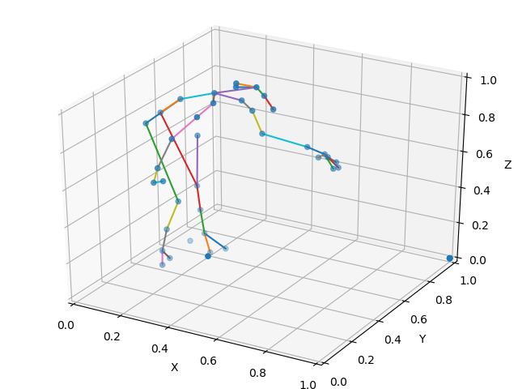
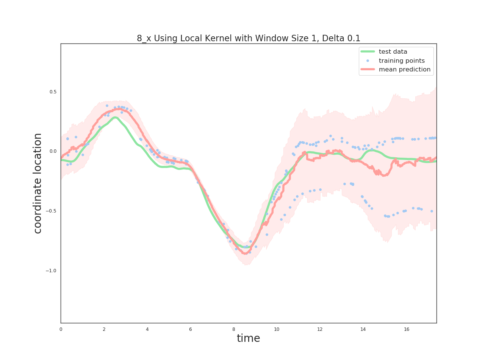

  

# Detecting Muscle Cocontraction Through Sliding Window Gaussian Processes
Code for project for graduate Machine Learning course.

my_gp.ipynb contains code for my own implementation of a Gaussian process. It is not as stable as the implementation provided by scikitlearn, 
which is what the sk_gp.ipynb is for.

sk_gp_3d.ipynb contains code for 3D Gaussian processes.

The general idea is that the hyperparameters of a Gaussian Process can encode the changes in the data itself. Thus if we do a sliding window over the data, we should be able to detect areas of potential muscle cocontraction.

  

